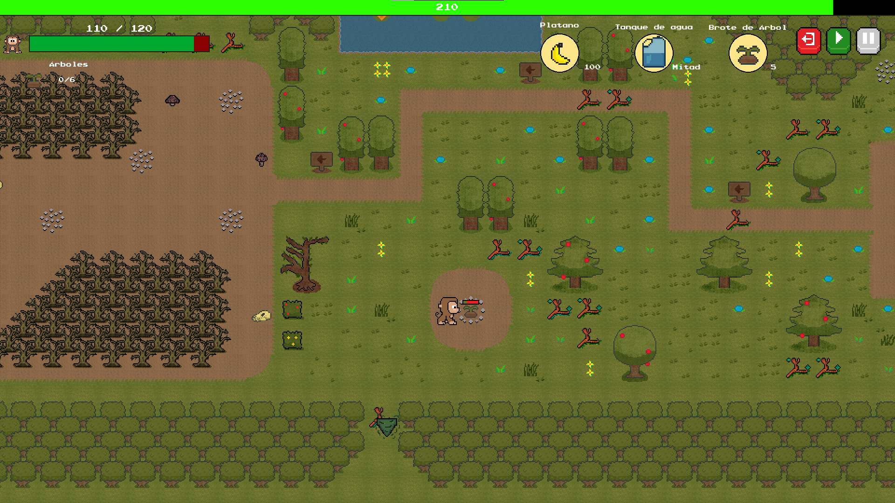
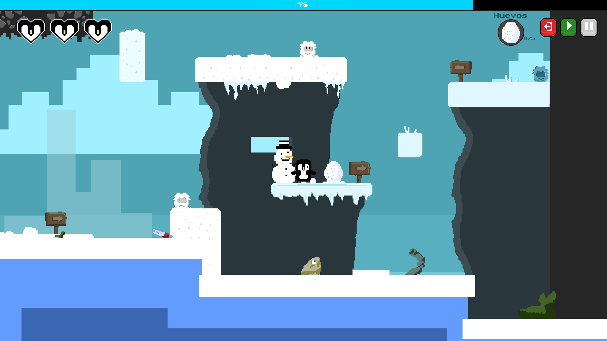
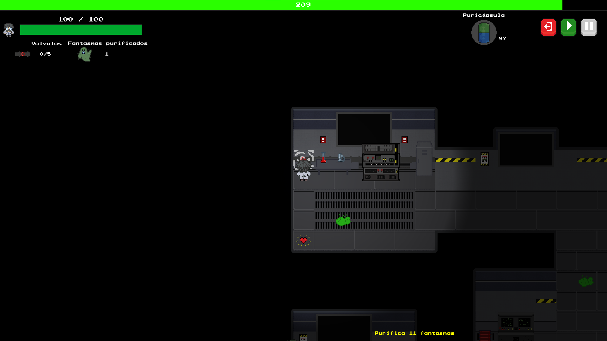

<p align="center">
  
</p>

# 🐒ANIMAL RESCUE: Misión 2050🧊


---

El año es 2050. La Tierra sufre las consecuencias devastadoras de la negligencia humana: la huella de carbono ha superado todos los límites, los ecosistemas colapsan y las especies luchan por sobrevivir en hábitats irreconocibles. *TinTin* el pingüino y *Tofu* el changuito, siendo rescatados por un laboratorio ecológico, toman cartas en el asunto.

Al unirse a la brigada *"ANIMAL RESCUE"*, se embarcan en una misión para restaurar los biomas devastados. Cada nivel representa una carrera contra el tiempo para salvar lo que queda de la biodiversidad terrestre.

## Galería del Juego

| Nivel 1: La Selva | Nivel 2: El Ártico | Nivel 3: Laboratorio |
|:---:|:---:|:---:|
|  |  |  |

## Objetivo de Desarrollo Sostenible (ODS 13)

Este proyecto académico está alineado con el *ODS 13: Acción por el Clima* de la ONU.
El videojuego busca concientizar a niños de primaria sobre:
* *Reforestación:* La importancia de recuperar la flora (Nivel 1).
* *Contaminación de Océanos:* El impacto de los desechos en la fauna marina (Nivel 2).
* *Emisiones de CO2:* La urgencia de detener los gases de efecto invernadero (Nivel 3).

## Guía de Instalación

Para poder jugar Animal Rescue, sigue estos pasos. Es altamente recomendable usar un entorno virtual.

### Requisitos Previos
* *Python:* Versión 3.8 o superior.
* *Git:* Instalado en tu sistema.

### Pasos

#### 1. Clonar el Repositorio
Abre tu terminal y clona el proyecto.

```bash
git clone [https://github.com/valent-x7/NaturalRescue.git](https://github.com/valent-x7/NaturalRescue.git)
```
2. Entrar a la carpeta
```bash
cd NaturalRescue
```
3. (RECOMENDADO) Crear entorno virtual
```bash
python -m venv venv      # Crear
venv\Scripts\activate    # Activar en Windows
# source venv/bin/activate  # Activar en Mac/Linux
```
4. Instalar dependencias
```bash
pip install -r requirements.txt
```
5. Ejecutar el juego
```bash
python src/main.py
```
## Controles para jugar


|Acción|Tecla|
|--|--|
| Movimiento | WASD / Flechas |
| Acción principal | H |
| Pausar | P |
| Regresar al menú | M |
| Salir | ESC |


## Estructura del proyecto
```text
AnimalRescue/
├──assets
│     ├──images # Sprites e imagenes del juego
│     ├──maps # Mapas en TSX y TMX
│     ├──music # Archivos de sonido para la música del videojuego
│     └──sound # SFX para el videojuego
├──img # Elementos visuales 
└──src
    ├──menus
    │    ├──fuentestexto # Fuentes usadas
    │    ├──level-select.py
    │    ├──menu.py
    │    ├──settings.py
    │    └──tutorial.py
    ├──scenes
    │     ├──gameover.py
    │     ├──level_2.py
    │     ├──level_one.py
    │     ├──level_three.py
    │     ├──play.py
    │     └──winscreen.py
    ├──ui
    │   ├──button.py
    │   ├──healthbar.py
    │   ├──item.py
    │   ├──timebar.py
    │   └──utils.py
    ├──game.py
    ├──main.py
    ├──prueba.py
    ├──settings.py
    └──sprites.py
```
## Contribuidores

1.Axl Enrique Díaz Hernández
2.Estefanía Radillo Domínguez
3.Greco Alejandro Serna Díaz
4.Manuel Isahit Martínez Contreras
5.Valentín Vaca Ciprés
